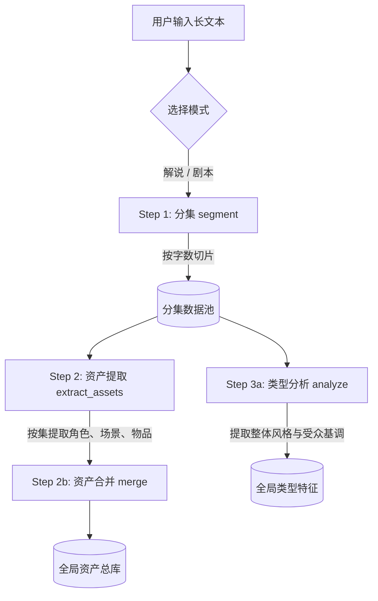

# 解说模式与剧本模式完整工作流图解（重构最新版）

本文档详细描述了纯前端化、流程解耦重构后的最新流水线工作流。所有流程现在统一由 `pure-frontend` 中的流水线引擎调度，并且在后续的**单元归并 (Step 4x)** 实现了完全规范的标准化处理。

---

## 1. 全局生命周期与公共前置步骤 (Step 1 ~ Step 3a)

不管是剧本模式还是解说模式，最前置的准备工作和全局状态管理是完全一致的。



---

## 2. 解说模式 (Narration Mode) 工作流

解说模式的核心特征是**“碎入整出”**：将长段的旁白文字拆得很碎（1~2句话）来方便生成单一分镜，最后为了符合视频生成的合理时长（通常需要大于4秒），再通过 Step 4x 跨单元合并。

```mermaid
graph TD
    subgraph Step 3b: 分镜创作 (本集闭环)
        S3b_1[Step 3b-1: 原文拆分 split<br/>按 1~2 句话极细颗粒度拆分] --> Val_1{拆分字数校验}
        Val_1 -- 失败重试 --> S3b_1
        Val_1 -- 成功 --> S3b_2[Step 3b-2: 镜头创作 shots<br/>为极短文段创作单个画面]
        S3b_2 --> Val_2{分镜格式校验}
        Val_2 -- 失败重试 --> S3b_2
    end
    
    Val_2 -- 成功 --> RawSB[(单集原始分镜池<br/>episodeStoryboard)]

    subgraph Step 4: 下游标准管道 (支持断点续传)
        RawSB --> S4x[Step 4x: 单元归并 groupUnits<br/>按中文字数计算实际耗时<br/>跨越原始段落，向 4~15s 贪心归并]
        S4x --> GroupedSB[(全新归并单元池<br/>groupedStoryboard)]
        
        GroupedSB --> S4a[Step 4a: 镜头分类 classify<br/>模型为归并后单元打签]
        S4a --> S4c[Step 4c: 视频提示词 video prompt<br/>利用最终单元信息请求生图/生视频模型]
    end
    
    S4c --> Output[前端最终展示结果]
```

---

## 3. 剧本模式 (Script Mode) 工作流

剧本模式的核心特征是**“场次包含多镜头”**：剧本拆分以明显的场景转换为界限（场次），每个场次内部包含由详细对白和运镜组成的多组复杂分镜。最后在 Step 4x 阶段，在场次内部以对白字数为基准严格卡控时长进行归并。

```mermaid
graph TD
    subgraph Step 3b: 分镜创作 (本集闭环)
        S3b_1_S[Step 3b-1: 原文拆分 split<br/>按场景转换/大剧情切分场次单元] --> Val_1_S{拆分字数校验}
        Val_1_S -- 失败重试 --> S3b_1_S
        Val_1_S -- 成功 --> S3b_2_S[Step 3b-2: 镜头创作 shots<br/>为每个场次单元生成包含多子镜头的复杂序列]
        S3b_2_S --> Val_2_S{分镜格式校验}
        Val_2_S -- 失败重试 --> S3b_2_S
    end
    
    Val_2_S -- 成功 --> RawSB_S[(单集原始分镜池<br/>episodeStoryboard)]

    subgraph Step 4: 下游标准管道 (支持断点续传)
        RawSB_S --> S4x_S[Step 4x: 单元归并 groupUnits<br/>基于剧本对白语速校准时长<br/>在原场次边界内进行 4~maxSec 贪心归并聚合]
        S4x_S --> GroupedSB_S[(全新归并单元池<br/>groupedStoryboard)]
        
        GroupedSB_S --> S4a_S[Step 4a: 镜头分类 classify<br/>模型为归并后单元打签]
        S4a_S --> S4c_S[Step 4c: 视频提示词 video prompt<br/>结合复杂场次动作与角色状态生成视频提示词]
    end
    
    S4c_S --> Output_S[前端最终展示结果]
```

---

## 4. 为什么要在 Step 4x 统一进行“单元归并”解耦？

以前版本中，剧本模式的归并在 Step 3b 步骤内“偷偷”完成了，这导致了架构耦合混乱。重构后的优势在于：

1. **数据可追溯**：`episodeStoryboard` 永远保存与原文最贴近、未经时间线篡改的**“原始创作分镜”**。您随时能还原模型当初创作时的想法。
2. **逻辑一致性**：无论解说还是剧本，只要进入 Step 4，面对的数据结构就变得**100% 格式统一**（都是被计算好总时长并具有全新独立 ID 的归并单元）。
3. **安全的中断与恢复**：用户如果对归并结果不满意（比如想改变最大时长），可以直接在前端重新调整配置跑一次 Step 4x，而**不需要花钱重新调用模型去生成分镜**（绕过了高成本的 Step 3b）。
