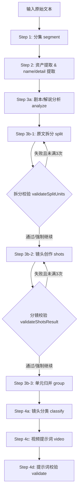
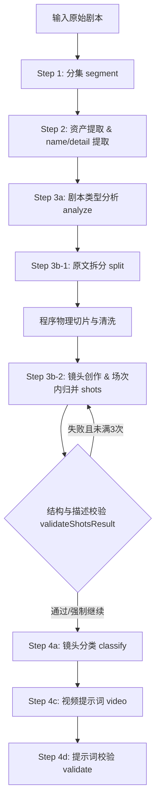

# 视频流程测试工具：解说模式与剧本模式完整工作流及数据规范

本文档详细拆解了视频流程测试工具中 **解说模式 (Narration Mode)** 与 **剧本模式 (Script Mode)** 的完整工作流、各阶段的输入输出数据结构、技术实现方案，并列出了因多次迭代遗留的废弃/过时代码。

---

## 目录
1. [解说模式 (Narration Mode) 完整工作流与数据规范](#1-解说模式-narration-mode-完整工作流与数据规范)
2. [剧本模式 (Script Mode) 完整工作流与数据规范](#2-剧本模式-script-mode-完整工作流与数据规范)
3. [核心技术方案汇总](#3-核心技术方案汇总)
4. [废弃与无用代码清单 (待清理)](#4-废弃与无用代码清单-待清理)

---

## 1. 解说模式 (Narration Mode) 完整工作流与数据规范

解说模式的核心目标是**将长篇幅的解说词/小说文本进行合理的切分，提取对应的资产信息，在生成细粒度镜头分镜后进行单元合并归并，最终产出符合视频制作规范的画面提示词。**

### 1.1 详细流程图与流转点


### 1.2 各步骤数据结构与规范

#### Step 1: 分集 (Segment)
*   **技术方案**：模型只识别顶层“集/章”标题锚点（使用系统提示词 `step1.system`）；后端程序负责长文本分批（10,000字/批 + 200字重叠）、并发调用模型识别、局部严格匹配去重、游标切分原文，以及对超长片段在句号/段落处均分。
*   **输入结构 (User Request)**:
    ```json
    {
      "text": "原始解说小说文本...",
      "useModel": true,
      "maxChars": 5000,
      "concurrent": 8
    }
    ```
*   **输出数据结构**:
    ```json
    {
      "episodes": [
        {
          "id": 1,
          "title": "第1集 · [提取的标题锚点]",
          "text": "本集文本内容...",
          "charCount": 2450
        }
      ],
      "markers": [
        {
          "exclusion_point": "第一章 缅北水牢",
          "absOrigStart": 0,
          "absOrigEnd": 8
        }
      ],
      "batchCount": 1,
      "samplePrompt": "...",
      "meta": { "model": "gemini-xxx", "prompts": [{ "key": "step1.system", "versionId": "...", "versionName": "初始版本" }] }
    }
    ```

#### Step 2: 资产提取 (Asset Extraction)
资产提取为三个阶段的组合，在合并阶段将实体以增量方式归并。
1.  **Step 2a: 资产名称提取**：提取当前集内的角色、场景和物品名称。
    *   **提示词**：`step2a.system`
    *   **输出**：`{ "new_character_names": ["林清"], "new_scene_names": ["水牢"], "new_item_names": [] }`
2.  **Step 2a_b: 资产更新检查**：检查已有资产在新增集里是否出现新造型/新状态/新形态。
    *   **提示词**：`step2a_b.system`
    *   **输出**：`{ "existing_character_updates": [], "existing_scene_updates": ["水牢"], "existing_item_updates": [] }`
3.  **Step 2b: 单实体详情提取**：对上述新增/更新实体并发调度大模型，提取其物理描述和造型状态。
    *   **提示词**：角色使用 `step2b.system.character`（传入全局音色库），场景使用 `step2b.system.scene`，物品使用 `step2b.system.item`。
    *   **输出**：
        ```json
        {
          "character": {
            "n": "林清",
            "v": "TTS音色名",
            "vd": "甜美少女音",
            "s": "女", "r": "黄种人", "a": "20", "rt": "主角",
            "ae": "黑长直，大眼睛，神情脆弱",
            "c": "身穿棉布裙",
            "looks": [{ "ln": "睡衣", "ld": "白色睡衣" }]
          }
        }
        ```
4.  **Step 2 合并 (Merge)**:
    *   **后端技术**：`step2_merge.js` 中 `mergeEntityDetail` 将详情累加，并与已有资产合并，去除临时标记 `_pending`，记录出场集数 `eps` (1起索引)。
    *   **最终资产库 (Assets) 结构**:
        ```json
        {
          "meta_info": { "global_style": "写实风格" },
          "narrator": { "n": "旁白", "v": "TTS音色名", "vd": "深沉旁白" },
          "characters": [
            { "n": "林清", "v": "音色", "vd": "描述", "s": "女", "looks": [{ "ln": "睡衣", "ld": "描述" }], "eps": [1] }
          ],
          "scenes": [
            { "s": "水牢", "states": [{ "sn": "白天阴冷", "sd": "描述" }], "eps": [1] }
          ],
          "items": []
        }
        ```

#### Step 3a: 剧本/解说分析 (Script Analysis)
*   **技术方案**：采样文本首尾共 8000 字，通过 LLM 分析剧本题材、节奏，推荐创作策略（`step3a.system`）。
*   **输出数据结构**:
    ```json
    {
      "genre": "都市犯罪",
      "audience": "青年男性",
      "pacing": "快节奏",
      "visual_focus": "手部细节特写与光影压迫",
      "emotion_style": "紧张克制",
      "recommended_strategy": "suspense",
      "notes": "建议多采用手持摄影和主观镜头"
    }
    ```

#### Step 3b-1: 原文拆分 (Original Text Split)
*   **技术方案**：解说模式下，前端将本集文本按 `maxUnitChars` (默认500字) 切段。后端对每段并发调用 LLM (`step3b-split.system.narration` + `step3b-split.creative.narration`），将文本拆解为带 `id/loc/ct` 的小语义单元，并匹配场景。
*   **中间校验步骤**：在每个段落（chunk）拆分后，立即执行程序硬性校验 (`validateSplitUnits`)：
    1.  **完整度与幻觉校验**：比对拆分后所有单元 `ct` 文本拼合后的结果与原始段落文本是否 100% 等价 (`ctTextsEquivalent`，忽略标点及章节前缀）。
    2.  **空字段与缺失校验**：检查单元 `ct` 是否为空，以及是否有 `loc.n` 场景字段缺失（缺失会给出 warning 级别警告）。
    3.  **重试机制**：若校验未通过，会自动重新调用大模型进行拆分（最多重试 2 次，共 3 次尝试）。如 3 次后均失败，则设置 `forced: true` 强制继续，并在前端向用户弹出警告 Toast。
*   **输出数据结构** (拆分后 units):
    ```json
    [
      {
        "id": 1,
        "loc": { "n": "水牢", "v": "白天阴冷" },
        "ct": "林清被推入水牢中。冰冷的水瞬间没过膝盖。"
      }
    ]
    ```

#### Step 3b-2: 镜头创作 (Shot Creation)
*   **技术方案**：前端接收到本集所有拆分后的 units 后，按批次并发调用后端镜头创作接口 (`step3b-shots.system.narration` + `step3b-shots.creative.narration`），根据剧本题材分析结论生成细粒度镜头参数（景别、角度、运镜、画面描述、旁白/对白及出场资产）。
*   **中间校验步骤**：在 LLM 返回镜头结果后，立即执行镜头生成校验 (`validateShotsResult`)：
    1.  **结构性校验**：核对大模型返回的单元列表中是否包含所有输入单元的 `id`，以及每个单元是否包含非空的 `shots` 列表。
    2.  **画面描述校验**：检查每个子镜头是否都提供了画面描述 (`ds` 字段非空）。
    3.  **原文还原校验 (解说模式特有)**：拼合每个单元下所有镜头的 `dlg` 对白或 `ct` 原文文本，验证其与原始拆分单元的 `ct` 在语义上是否 100% 字符级等价 (`ctTextsEquivalent`)。
    4.  **重试机制**：若校验未通过，会自动重试该批次调用（最多重试 2 次，共 3 次尝试）。如重试 3 次后依然失败，则采用带防错容瑕的结果，避免流程卡死。
*   **输出数据结构** (storyboard.storys):
    ```json
    {
      "storys": [
        {
          "id": 1,
          "loc": { "n": "水牢", "v": "白天阴冷" },
          "ct": "林清被推入水牢中。冰冷的水瞬间没过膝盖。",
          "shots": [
            {
              "sc": "中景",
              "ag": "俯拍",
              "mv": "固定镜头",
              "ds": "昏暗的水牢里，林清身体失去平衡，向下倒去，溅起大片水花。",
              "dlg": { "VO": "林清被推入水牢中。冰冷的水瞬间没过膝盖。" },
              "vo": { "VO": "旁声音色" },
              "dur": 4.5,
              "chars": [{ "n": "林清", "l": "睡衣" }],
              "itm": []
            }
          ]
        }
      ]
    }
    ```

#### Step 3b-3: 单元归并 (Unit Grouping)
*   **技术方案**：在解说模式镜头创作与校验完成后，前端在 **Step 3b 步骤内**会立即调用后端 `/api/pipeline/step4x/group` 接口对本集分镜进行自动单元合并（而非作为独立步骤留到第 4 步）。
    1.  **时长校正**：调用 `correctShotsDurations` 根据旁白文本字符长度（中文字符/标点 5.5 字/s，英文字符/标点 14 字/s，向上取整）重算并锁定每个镜头的 `dur`，且校正值不得低于 LLM 输出的原始时长。
    2.  **带回溯的贪心归并**：在集内将连续分镜单元的时长进行累加，使其尽量落入 **4s ~ 15s** 的目标区间（组内 shots 累加超过 15s 时切割为新组；不足 4s 时向前或向后贪心合并，若最后一组依然不足 4s 且前一组累加不超过 15s 则与其归并，否则强行补足至 4s）。
*   **归并后 storyboard.storys 结构** (注意 shots 呈嵌套结构，归并结果直接覆盖本集 storyboard 数据):
    ```json
    {
      "storys": [
        {
          "id": 1,
          "episodeIndex": 0,
          "originalSceneId": 1,
          "shots": [
            {
              "originalId": 1,
              "ct": "林清被推入水牢中...",
              "loc": { "n": "水牢", "v": "白天阴冷" },
              "shots": [ ... ] // 原始镜头列表，且 dur 已经过校正
            }
          ],
          "ct": "合并后的单元原文文本",
          "locs": [{ "n": "水牢", "v": "白天阴冷" }],
          "totalTime": 8.0
        }
      ]
    }
    ```

#### Step 4x: 单元归并 (Frontend Pass-through)
*   **技术方案**：因解说模式和剧本模式的单元归并已分别在 Step 3b（末尾或后端直接完成），前端的 Step 4x 步骤对此只做**透传处理**（`groupedStoryboardPerEpisode.value[i] = episodeStoryboard.value[i]`），步骤状态立即置为 `done`，不支持也不需要用户手动合并。

#### Step 4a: 镜头分类 (Shot Classification)
*   **技术方案**：将归并后的单元文本账单传给大模型 (`step4a.system`），为每个归并后的 unit 判断大类标签（动作戏/文戏等）。
*   **输出数据结构**:
    ```json
    [
      { "unit_id": 1, "type": "表情情感戏" }
    ]
    ```

#### Step 4c: 视频提示词创作 (Video Prompt)
*   **技术方案**：根据单元的 classification 类型，从前端提取对应的模板（动作/表情等），调用大模型 (`step4c.system.narration` + 类型模版种子），生成最终的单段视频生成提示词。
*   **输出数据结构**:
    ```json
    [
      {
        "n": 1,
        "p": "[time:4] [camera:中景俯拍] [p:林清#睡衣] 在昏暗潮湿的水牢里挣扎，溅起大片水花。对白：VO：\"林清被推入水牢中。\" [time:4] ...",
        "dlgs": ["VO"]
      }
    ]
    ```

#### Step 4d: 视频提示词校验 (Validation)
*   **技术方案**：通过程序校验输出格式。检查对白是否被包含、时长 `[time:X]` 与归并台账是否一致、角色标签是否写为规范 of `[p:角色名#造型名]` 等。
*   **输出结构**:
    ```json
    {
      "pass": true,
      "issues": []
    }
    ```

---

## 2. 剧本模式 (Script Mode) 完整工作流与数据规范

剧本模式适用于**有角色对白（Dialog）和动作描写（Action）的专业剧本**。由于剧本天然由“场次标题”区隔，且时长主要由对白发音决定，因此剧本模式的拆分 and 归并策略与解说模式有显著的物理和逻辑差异。

### 2.1 详细流程图与流转点


> [!IMPORTANT]
> **物理流转差异**：剧本模式在 Step 3b-2（镜头创作）的后端代码末尾**直接集成了单元归并算法 (Step 4x)**。也就是说，在分镜创作完成时，剧本模式的分镜数据已经是归并好的了。前端的 Step 4x 步骤对此步骤只做透明传输，用户不需要也无法在界面上单独操作剧本单元的合并。

### 2.2 各步骤数据结构与规范

#### Step 1 & Step 2 & Step 3a
*   基本流转方式及输入输出结构与解说模式保持一致。其中 Step 2a 提取时，传入的 textType 为 `"剧本"`。

#### Step 3b-1: 剧本原文拆分 (Original Text Split)
*   **技术方案**：剧本模式下，后端直接使用大文本批次机制（`BATCH_SIZE = 10000`），调用大模型识别场次切分点（系统提示词：`step3b-split.system.script`），返回 `exclusion_point` 和 `context_after` 锚点。后端通过 `splitScriptByMarkers` 纯程序切分出各个场次。
*   **中间校验与程序保证**：
    1.  **物理切分保障**：不同于解说模式让 LLM 直接生成单元原文，剧本模式下是由后端程序根据 LLM 提取的锚点标记在原始文本中利用模糊对齐算法定位物理偏移量，随后直接进行**物理切片 (Substring)**。这从根本上保障了原文的 100% 无损还原，规避了 LLM 漏字与幻觉。
    2.  **清理与空值剔除**：程序会自动清除不含任何中文或数字的无效空场次。若大模型未能识别出任何切分点，程序会自动兜底将整篇文本作为一个单一场次返回，防止流程中断。
*   **输出数据结构** (units):
    ```json
    [
      {
        "id": 1,
        "ct": "【1-1 夜 内 缅北电诈园区水牢】\n林清双手被铁链吊在半空...\n林清（虚弱地）：放我出去..."
      }
    ]
    ```
    *(注意：剧本模式在拆分阶段并不给单元填充 `loc`，该字段在下一步骤由大模型和场景资产匹配填充。)*

#### Step 3b-2: 剧本镜头创作与场次内归并 (Shots & Grouping)
这是剧本模式最具差异的步骤。
*   **技术方案**:
    1.  将上述场次单元及对应的资产、剧本创作规则 (`step3b-shots.system.script` + `step3b-shots.creative.script`) 送入大模型，大模型输出包含 `loc` 及细分 `shots` 的 JSON 对象。
    2.  后端程序在收到大模型输出后，首先调用 `correctShotsDurations(shots, 'script')`，对每个子镜头的对白（`dlg`）字数执行时长校正：**中文 6字/秒，英文 16字/秒，向上取整，无台词镜头默认为原始时长或1秒**。
    3.  立即在**当前场次内部**进行贪心归并（`groupEpisodeScriptUnits`）：相邻镜头时间累加，目标时长为 **4~maxSec** (通常为 10~15s)，且**绝对不会跨越场次边界合并**。
    4.  归并后的镜头数组是**扁平的** (即 `shots` 字段是扁平子镜头列表，不嵌套单元)，结构对下游 Step 4完美兼容。
*   **中间校验步骤**：在 LLM 返回分镜结果后，后端会立即调用 `validateShotsResult` 进行程序级强校验：
    1.  **单元完整度校验**：核查大模型返回的单元列表中是否包含所有输入单元的 `id`，防止场次丢失。
    2.  **分镜存在性校验**：核查所有单元的 `shots` 列表是否均非空。
    3.  **画面描述校验**：核查每个子镜头的 `ds` (画面描述) 字段是否非空。
    4.  **重试机制**：若上述任何一项校验失败，会自动重试当前分镜创作调用（最多重试 2 次，共 3次尝试），在 3 次均失败后，采用最后一次包含瑕疵的结果。
*   **输出数据结构** (storyboard.storys):
    ```json
    {
      "storys": [
        {
          "id": 1,
          "episodeIndex": 0,
          "originalSceneId": 1,
          "loc": { "n": "水牢", "v": "白天阴冷" },
          "ct": "本归并组对应的剧本原文句子与对话...",
          "shots": [
            {
              "sc": "近景",
              "ag": "平视",
              "mv": "推镜头",
              "ds": "林清双手挂着铁链，身形摇晃。",
              "dlg": { "林清": "放我出去..." },
              "vo": { "林清": "音色A" },
              "dur": 2.0, // 校正后的时长
              "ct": "林清（虚弱地）：放我出去...",
              "chars": [{ "n": "林清", "l": "睡衣" }],
              "itm": []
            }
          ],
          "totalTime": 6.0
        }
      ]
    }
    ```

#### Step 4x: 单元归并 (Frontend Pass-through)
*   **技术方案**：前端在 Ep 步骤运行到 `s4x` 时，检测到是剧本模式，直接将 Step 3b 的输出透传给归并状态：`groupedStoryboardPerEpisode.value[i] = episodeStoryboard.value[i]`，并将步骤设为 `done`。

#### Step 4a: 剧本镜头分类 (Shot Classification)
*   **技术方案**：与解说模式共享同一后端节点，但在发送给 LLM 时传入参数 `mode: 'script'`，此时系统提示词中的 `{{mode}}` 渲染为 `"剧本"`，辅助模型判断剧本环境下的戏份类型。
*   **输出数据结构**:
    ```json
    [
      { "unit_id": 1, "type": "基础文戏" }
    ]
    ```

#### Step 4c: 剧本视频提示词创作 (Video Prompt)
*   **技术方案**：调用大模型生成视频提示词。后端根据 `mode === 'script'` 选择系统提示词 `step4c.system.script`，并结合各镜头类型的创作模板，生成最终视频生成提示词。
*   **输出数据结构**:
    ```json
    [
      {
        "n": 1,
        "p": "[time:2] [camera:中景平视] [p:林清#睡衣] 挂在吊链上，身体无力摇晃。对白：林清：\"放我出去...\" [time:2] ...",
        "dlgs": ["林清"]
      }
    ]
    ```

#### Step 4d: 剧本视频校验 (Validation)
*   基本运行与规则和解说模式相同，校验产出最后的可用账单。

---

## 3. 核心技术方案汇总

1.  **大模型调用与多级回退 (LLM Retries & Fallback)**:
    *   在 `llmClient.js` 中封装了统一的 JSON 块提取和重试逻辑（默认 retries=3）。
    *   在分段拆分等关键节点，提供 Schema 物理强校验与 100% 原文还原校验（`ctCompare.js`），校验失败时自动触发 LLM 重试，确保数据流通的确定性。
2.  **资产 subset 注入技术 (Appearance Subset)**:
    *   在 Step 3b-2 和 Step 4c 等下游大模型任务中，避免大文本把全局累积的资产库全部塞入提示词，而是在 `_shared.js` 中使用 `subsetByAppearance`。
    *   根据本集/本单元中出场的实体列表（`episodeAppearance`），提取出局部资产子集（仅包含有出场记录的角色造型、场景状态描述等），使大模型上下文成本和噪声显著降低。
3.  **时间台账程序下放与校正 (Deterministic Duration Calculation)**:
    *   抛弃早期让大模型直接估算时间的做法，将对白字数转换时间的逻辑彻底固化在程序代码中，解说词和剧本台词各有一套公式，在归并和视频提示词环节强行注入 `dur`，锁定视频各子镜头的绝对时序。
4.  **增量资产合并算法 (Incremental Merge)**:
    *   在 `step2_merge.js` 中，提供针对 Character/Scene/Item 各自子列表的精确合并去重机制（对 looks / states / variants 取并集并增量补全描述），能够确保旧有描述和音色不会在多次提取中被覆盖丢失。

---

## 4. 废弃与无用代码清单 (待清理)

在梳理整个代码库后，发现由于项目的多次重构，以下文件、函数与接口已经不再被任何活跃流程所使用，建议从物理或逻辑上予以排除清理：

### 4.1 物理完全废弃的文件

1.  `backend/src/pipeline/step4b_duration.js`
    *   **现状**：该文件提供“时长重算”的大模型辅助节点，但其挂载的路由接口 `/api/pipeline/step4b/duration` 在 `pipeline.routes.js` 中已被注销，前端 `App.vue` 也完全移除了对此 API 的调用。
    *   **清理建议**：直接物理删除。
2.  `backend/src/validators/durationValidator.js`
    *   **现状**：该校验文件提供解说字数上限警告以及比例压缩时长的工具方法，但它唯一的引用者是 `step4b_duration.js`。其余流程的时长校正和字数统计已在 `step4x_groupUnits.js` 中独立实现。
    *   **清理建议**：直接物理删除。
3.  `backend/src/validators/assetRefValidator.js`
    *   **现状**：提供了分镜中的角色造型/场景状态与资产库 100% 对应的强一致性校验方法 `validateAssetRefs`。在实际系统运作中，该校验逻辑已被解耦，没有任何后端路由、控制器或前端界面对其发起调用。
    *   **清理建议**：直接物理删除。

### 4.2 废弃或部分失效的逻辑

1.  **Step 3d (分镜修复) 阶段缺失后端实现**
    *   **现状**：在全局提示词注册表 `promptStore.js` 中注册了 `step3d-repair` 节点，并且前端代码的保存与加载规范中依然支持 `step3d` 状态和结果归档。但后端 `pipeline/` 下没有任何 `step3d` 逻辑文件，且 `pipeline.routes.js` 里也没有挂载 `/api/pipeline/step3d/repair` 接口。若用户在旧编译的前端页面上点击“修复分镜”按钮，会由于接口缺失而直接抛出 API 错误。
    *   **清理建议**：前端 `App.vue` 应彻底移除“修复”相关的交互入口，后端 `promptStore.js` 移除非必要的注册项和种子提示词。
2.  **`validateStoryboardSchema` 在 `validators/schemaValidator.js` 中未使用**
    *   **现状**：该文件导出了 `validateStoryboardSchema`，但后端并没有调用它进行 Storyboard 的结构强校验。当前系统仅在 `step3b_createShots.js` 中使用 `validateShotsResult` 手动完成 hardcode 的检查。
    *   **清理建议**：从该文件中移除 `validateStoryboardSchema` 函数。
3.  **`applyFrozenDurations` 在 `backend/src/pipeline/_shared.js` 中未使用**
    *   **现状**：该共享函数用于将 frozen 时长回填到分镜 shots 中，但它是为了配合已经废弃的 `step4b` 时长重算环节而编写的，属于死代码。
    *   **清理建议**：直接从 `_shared.js` 中删除该函数。
